<p align="center">
  
</p>

<p align="center">
  <strong>Give your AI agent access to any API. Automatically.</strong>
</p>

<p align="center">
  Point Skyline at an API spec, add credentials, and every endpoint becomes an MCP tool your AI can call.<br/>
  No glue code. No per-API adapters. Just config.
</p>

<br/>

---

## What is Skyline?

Skyline is an **MCP (Model Context Protocol) server** that turns external APIs into tools AI agents can use. It reads API specifications, normalizes them into a canonical model, and exposes every operation as a callable MCP tool with full JSON Schema validation.

You describe your APIs in a YAML file. Skyline does the rest:

```
  ┌──────────────┐      ┌────────────────┐      ┌──────────────────┐
  │  API Specs   │ ---> │    Skyline      │ ---> │    MCP Tools     │
  │              │      │                 │      │                  │
  │  OpenAPI     │      │  Auto-detect    │      │  tools/list      │
  │  Swagger 2   │      │  Parse & norm   │      │  tools/call      │
  │  GraphQL     │      │  Validate       │      │  resources/list  │
  │  SOAP/WSDL   │      │  Execute        │      │  resources/read  │
  │  OData v4    │      │                 │      │                  │
  │  gRPC        │      │  stdio / HTTP   │      │  Claude, Cursor  │
  │  JSON-RPC    │      │                 │      │  or any MCP host │
  │  Postman     │      │                 │      │                  │
  │  Jenkins     │      │                 │      │                  │
  │  Jira Cloud  │      │                 │      │                  │
  │  Google API  │      │                 │      │                  │
  └──────────────┘      └────────────────┘      └──────────────────┘
```

---

## Supported API Types

Skyline auto-detects the spec format. No manual configuration needed.

| Protocol | Detection | Notes |
|---|---|---|
| **OpenAPI 3.x** | `openapi` field in JSON/YAML | Full path, query, header, and body parameter support |
| **Swagger 2.0** | `swagger` field | Automatically converted to OpenAPI 3 internally |
| **GraphQL** | SDL files or introspection | Builds typed queries with variable support and selection sets |
| **WSDL 1.1 / SOAP** | XML with `<definitions>` | Generates SOAP envelopes, parses XML responses to JSON |
| **OData v4** | CSDL `$metadata` XML | Generates CRUD operations per EntitySet with OData query options |
| **gRPC** | `spec_type: grpc` in config | Discovers services via gRPC reflection; builds dynamic protobuf messages |
| **OpenRPC / JSON-RPC** | `openrpc` field in JSON | Wraps calls in JSON-RPC 2.0 envelopes; supports `rpc.discover` |
| **Postman Collections** | `schema.getpostman.com` in JSON | Walks v2.x collection items; supports folders, path/query/header params, body modes |
| **Google API Discovery** | `discoveryVersion` field | Maps Google's discovery format to REST operations |
| **Jenkins 2.545** ⚠️ | `/api/json` object graph | **34 operations** - Custom implementation. Jobs, builds, pipelines, Blue Ocean, nodes, credentials, plugins, queue. Full CSRF support. See [special cases](#special-cases) |
| **Slack Web API** ⚠️ | `{"ok":...}` response format | **23 operations** - Custom implementation. Chat, conversations, users, files, reactions, pins, reminders. See [special cases](#special-cases) |
| **Jira Cloud** | `*.atlassian.net` host | Auto-fetches the official Atlassian OpenAPI spec |

---

## Quickstart

### 1. Create a config

Config files support both **YAML** and **JSON** formats (auto-detected):

**YAML** (recommended for readability):
```yaml
# config.yaml
apis:
  - name: petstore
    spec_url: https://petstore3.swagger.io/api/v3/openapi.json
    auth:
      type: api-key
      header: X-API-Key
      value: ${PETSTORE_API_KEY}
```

**JSON** (for programmatic generation):
```json
{
  "apis": [
    {
      "name": "petstore",
      "spec_url": "https://petstore3.swagger.io/api/v3/openapi.json",
      "auth": {
        "type": "api-key",
        "header": "X-API-Key",
        "value": "${PETSTORE_API_KEY}"
      }
    }
  ]
}
```

Secrets use `${ENV_VAR}` syntax and are automatically redacted from all logs.

### 2. Run

```bash
# stdio (for Claude Desktop, Cursor, etc.)
go run ./cmd/mcp-api-bridge --config ./config.yaml

# streamable HTTP (for networked MCP clients)
go run ./cmd/mcp-api-bridge --config ./config.yaml --transport http --listen :8080
```

### 3. Connect your AI

Add Skyline to your MCP client config. For Claude Desktop:

```json
{
  "mcpServers": {
    "skyline": {
      "command": "./bin/mcp-api-bridge",
      "args": ["--config", "./config.yaml"]
    }
  }
}
```

That's it. Your AI agent now has typed, validated tools for every API endpoint.

---

## Architecture

Skyline is built around three components:

### Skyline MCP Server &nbsp;`cmd/mcp-api-bridge`

The core. Loads your config, fetches and parses API specs, builds MCP tools, and serves them over stdio or HTTP.

```
Config (YAML)
  → Spec Fetcher (URL or file)
    → Auto-Detect adapter (OpenAPI | Swagger2 | GraphQL | WSDL | OData | OpenRPC | Postman | gRPC | Jenkins | Google | Jira)
      → Canonical Model (Service → Operations → Parameters + Schemas)
        → MCP Registry (tools + resources + JSON Schema validators)
          → MCP Server (JSON-RPC 2.0 over stdio or streamable HTTP)
            → Runtime Executor (HTTP requests, gRPC calls, JSON-RPC envelopes, auth, retries)
```

### Config Server &nbsp;`cmd/skyline-server`

A web application for managing API configurations through profiles. Encrypted storage, bearer-token auth, and a built-in UI for creating, editing, and testing configurations before deploying them.

```bash
export CONFIG_SERVER_KEY="$(openssl rand -base64 32)"
go run ./cmd/skyline-server --listen :9190
# Open http://localhost:9190/ui/
```

Features:
- **Profile management** — Create named profiles (dev, staging, prod) each with their own API config
- **AES-GCM encryption** — Profiles are encrypted at rest
- **Spec detection** — Paste a base URL and auto-discover what API specs are available
- **Spec testing** — Verify spec URLs are reachable before saving
- **Remote config** — The MCP server can pull its config from the config server at startup

### Mock API Server &nbsp;`mock-api/`

A standalone mock server for development and testing. Serves working mock APIs for every supported generic protocol type:

| Mock API | Protocol | Endpoints |
|---|---|---|
| Pets | OpenAPI 3.x | `GET/POST /openapi/pets`, `GET/PUT/DELETE /openapi/pets/{id}` |
| Dinosaurs | Swagger 2.0 | `GET/POST /swagger/dinosaurs`, `GET/PUT/DELETE /swagger/dinosaurs/{id}` |
| Plants | WSDL / SOAP | `POST /wdsl/soap` with SOAP envelope |
| Cars | GraphQL | `POST /graphql` with query/mutation |
| Movies | OData v4 | `GET/POST /odata/Movies`, `GET/PUT/PATCH/DELETE /odata/Movies({id})` |
| Calculator | OpenRPC / JSON-RPC | `POST /jsonrpc` (add, subtract, multiply, divide + `rpc.discover`) |
| Clothes | gRPC | Ports `50051-50054` (hats, shoes, pants, shirts) with reflection |

```bash
cd mock-api && go run .
# Listening on http://localhost:9999
```

---

## Configuration Reference

### Full config example

```yaml
apis:
  - name: petstore-openapi
    spec_url: http://localhost:9999/openapi/openapi.json
    base_url_override: http://localhost:9999/openapi
    auth:
      type: bearer
      token: ${PETSTORE_TOKEN}

  - name: plants-soap
    spec_url: http://localhost:9999/wdsl/wsdl
    auth:
      type: bearer
      token: ${PLANTS_TOKEN}

  - name: cars-graphql
    spec_url: http://localhost:9999/graphql/schema
    base_url_override: http://localhost:9999/graphql
    auth:
      type: basic
      username: ${GRAPHQL_USER}
      password: ${GRAPHQL_PASS}

  - name: jira-cloud
    spec_url: https://your-domain.atlassian.net
    base_url_override: https://your-domain.atlassian.net
    auth:
      type: basic
      username: ${JIRA_EMAIL}
      password: ${JIRA_API_TOKEN}

  - name: movies-odata
    spec_url: http://localhost:9999/odata/$metadata
    base_url_override: http://localhost:9999/odata
    auth:
      type: bearer
      token: ${ODATA_TOKEN}

  - name: calculator-jsonrpc
    spec_url: http://localhost:9999/jsonrpc/openrpc.json
    base_url_override: http://localhost:9999/jsonrpc
    auth:
      type: api-key
      header: X-API-Key
      value: ${JSONRPC_KEY}

  - name: clothes-grpc
    spec_type: grpc
    base_url_override: localhost:50051
    auth:
      type: bearer
      token: ${GRPC_TOKEN}

  - name: jenkins
    spec_url: https://jenkins.example.com/api/json
    base_url_override: https://jenkins.example.com
    auth:
      type: basic
      username: ${JENKINS_USER}
      password: ${JENKINS_API_TOKEN}  # Generate at /me/configure

timeout_seconds: 10
retries: 1
```

### Auth types

| Type | Fields |
|---|---|
| `bearer` | `token` |
| `basic` | `username`, `password` |
| `api-key` | `header`, `value` |

### API config fields

| Field | Required | Description |
|---|---|---|
| `name` | yes | Unique name for this API (used as tool name prefix) |
| `spec_url` | yes* | URL or file path to the API spec |
| `spec_type` | no | Force spec type instead of auto-detect. Currently only `grpc` is supported |
| `base_url_override` | no* | Override the base URL from the spec. Required for gRPC (`host:port`) |
| `auth` | no | Authentication config (see auth types below) |
| `jenkins` | no | Jenkins-specific config for write operations |

\* `spec_url` is not required when `spec_type: grpc` is set (uses live reflection instead).

### MCP server flags

| Flag | Default | Description |
|---|---|---|
| `--config` | `./config.yaml` | Path to config file (YAML or JSON, auto-detected) |
| `--config-url` | | Config server URL (replaces `--config`) |
| `--profile` | | Profile name when using `--config-url` |
| `--transport` | `stdio` | `stdio`, `http`, or `sse` |
| `--listen` | `:8080` | Listen address for HTTP transport |

### Config server flags

| Flag | Default | Description |
|---|---|---|
| `--listen` | `:9190` | HTTP listen address |
| `--storage` | `./profiles.enc.yaml` | Encrypted storage path |
| `--auth-mode` | `bearer` | `bearer` or `none` |
| `--key-env` | `CONFIG_SERVER_KEY` | Env var holding the 32-byte AES key |
| `--env-file` | | Optional `.env` file to load |

---

## Using with Config Server Profiles

Instead of local YAML files, pull config from the config server at runtime:

```bash
# Start the config server
export CONFIG_SERVER_KEY="$(openssl rand -base64 32)"
go run ./cmd/skyline-server --listen :9190

# Create a profile via the web UI at http://localhost:9190/ui/
# Then run the MCP server with that profile:
export MCP_PROFILE=dev
export MCP_PROFILE_TOKEN=your-profile-token
go run ./cmd/mcp-api-bridge --config-url http://localhost:9190
```

---

## Project Layout

```
skyline-mcp-api-bridge/
│
├── cmd/                              # ── Entrypoints ────────────────
│   ├── mcp-api-bridge/               #    Skyline MCP server
│   │   └── main.go
│   └── skyline-server/                #    Config profile server + web UI
│       ├── main.go
│       └── ui/                       #    Embedded frontend
│           ├── index.html
│           ├── app.js
│           └── styles.css
│
├── internal/                         # ── Core ───────────────────────
│   ├── canonical/                    #    Unified API model
│   │   ├── types.go                  #      Service, Operation, Parameter
│   │   └── naming.go                 #      Tool name generation
│   ├── config/                       #    Configuration
│   │   ├── config.go                 #      Types, validation, defaults
│   │   ├── load.go                   #      YAML file loading
│   │   ├── parse.go                  #      YAML parsing
│   │   ├── env.go                    #      ${ENV_VAR} expansion
│   │   └── remote.go                 #      Config server profile fetching
│   ├── mcp/                          #    MCP Protocol
│   │   ├── server.go                 #      JSON-RPC 2.0 handler (stdio)
│   │   ├── http_sse.go               #      Streamable HTTP + SSE transport
│   │   └── registry.go               #      Tool & resource registry
│   ├── runtime/                      #    Execution
│   │   └── executor.go               #      HTTP client, auth, retries
│   ├── redact/                       #    Security
│   │   └── redact.go                 #      Secret redaction for logs
│   │
│   ├── spec/                         # ── Spec Pipeline ──────────────
│   │   ├── adapter.go                #      SpecAdapter interface
│   │   ├── loader.go                 #      Auto-detect + parse orchestrator
│   │   ├── fetch.go                  #      Spec URL fetcher
│   │   ├── openapi_adapter.go        #      OpenAPI 3.x adapter
│   │   ├── swagger2_adapter.go       #      Swagger 2.0 adapter
│   │   ├── graphql_adapter.go        #      GraphQL adapter
│   │   ├── graphql_introspection.go  #      GraphQL introspection query
│   │   ├── wsdl_adapter.go           #      WSDL / SOAP adapter
│   │   ├── odata_adapter.go          #      OData v4 adapter
│   │   ├── openrpc_adapter.go        #      OpenRPC / JSON-RPC adapter
│   │   ├── postman_adapter.go        #      Postman Collections adapter
│   │   ├── grpc_adapter.go           #      gRPC adapter
│   │   ├── google_adapter.go         #      Google API Discovery adapter
│   │   ├── jenkins_adapter.go        #      Jenkins adapter
│   │   └── jenkins_writes.go         #      Jenkins write operations
│   │
│   └── parsers/                      # ── Parsers ────────────────────
│       ├── openapi/                  #      OpenAPI 3.x parser
│       ├── swagger2/                 #      Swagger 2.0 parser
│       ├── graphql/                  #      GraphQL SDL + introspection
│       ├── wsdl/                     #      WSDL 1.1 parser
│       ├── odata/                    #      OData v4 CSDL parser
│       ├── openrpc/                  #      OpenRPC / JSON-RPC parser
│       ├── postman/                  #      Postman Collection v2.x parser
│       ├── grpc/                     #      gRPC reflection parser
│       ├── googleapi/                #      Google API Discovery parser
│       └── jenkins/                  #      Jenkins object graph parser
│
├── mock-api/                         # ── Testing ────────────────────
│   ├── server.go                     #    Mock APIs (all supported protocols)
│   ├── server_test.go
│   └── clothes.proto                 #    gRPC proto definition
│
├── examples/                         # ── Examples ───────────────────
│   ├── config.yaml.example           #    Full config with all API types
│   ├── config.mock.yaml              #    Config for mock-api server
│   ├── config.yaml                   #    Minimal working config
│   └── skyline-server.env.example     #    Config server env template
│
├── assets/                           # ── Branding ───────────────────
│   ├── skyline-banner.svg
│   └── skyline-logo.svg
│
├── go.mod
├── go.sum
└── README.md
```

---

## Jenkins 2.545 Integration

Skyline provides comprehensive support for Jenkins 2.x with **34 operations** covering all major Jenkins APIs. Perfect for CI/CD automation, build management, and pipeline orchestration.

### Quick Start

```yaml
apis:
  - name: jenkins
    spec_url: https://jenkins.example.com/api/json
    base_url_override: https://jenkins.example.com
    auth:
      type: basic
      username: admin
      password: ${JENKINS_API_TOKEN}
```

### Features

- ✅ **Auto-detects Jenkins 2.x** - No manual configuration
- ✅ **34 operations** across 10 API categories
- ✅ **Automatic CSRF handling** - Crumb fetching and caching
- ✅ **Parameterized builds** - Full parameter support
- ✅ **Pipeline support** - Jenkinsfile creation, replay, stages
- ✅ **Blue Ocean API** - Modern Pipeline visualization

### Operations Coverage

| Category | Operations | Examples |
|----------|------------|----------|
| **Core** (3) | Root, object queries, version | `jenkins__getVersion`, `jenkins__getRoot` |
| **Job Management** (9) | CRUD, enable/disable, copy | `jenkins__createJob`, `jenkins__listJobs` |
| **Build Operations** (7) | Trigger, stop, logs, artifacts | `jenkins__triggerBuild`, `jenkins__getBuildLog` |
| **Pipeline** (3) | Create, replay, stages | `jenkins__createPipeline`, `jenkins__getPipelineStages` |
| **Queue** (2) | View, cancel | `jenkins__getQueue`, `jenkins__cancelQueueItem` |
| **Nodes** (4) | List, configure, offline, delete | `jenkins__listNodes`, `jenkins__markNodeOffline` |
| **Credentials** (1) | List stores | `jenkins__listCredentials` |
| **Plugins** (1) | List installed | `jenkins__listPlugins` |
| **Blue Ocean** (2) | Pipelines, runs | `jenkins__blueOceanPipelines` |
| **Users** (2) | User info | `jenkins__getCurrentUser`, `jenkins__getUser` |

### Example Usage

**List all jobs:**
```json
{
  "tool": "jenkins__listJobs",
  "arguments": {}
}
```

**Trigger a parameterized build:**
```json
{
  "tool": "jenkins__triggerBuildWithParameters",
  "arguments": {
    "jobName": "deploy-prod",
    "parameters": {
      "BRANCH": "main",
      "ENVIRONMENT": "production"
    }
  }
}
```

**Get build console log:**
```json
{
  "tool": "jenkins__getBuildLog",
  "arguments": {
    "jobName": "my-job",
    "buildNumber": "lastBuild"
  }
}
```

### Deployment Example

**Kubernetes (Tested with Jenkins 2.545):**
```yaml
apiVersion: apps/v1
kind: Deployment
metadata:
  name: jenkins
spec:
  template:
    spec:
      containers:
      - name: jenkins
        image: jenkins/jenkins:2.545-jdk21
        ports:
        - containerPort: 8080
```

See **[docs/JENKINS-2.545-SUPPORT.md](docs/JENKINS-2.545-SUPPORT.md)** for complete documentation including:
- All 34 operations with examples
- Authentication guide (API tokens)
- CSRF handling details
- Troubleshooting guide
- Pipeline operations
- Blue Ocean integration

---

## Special Cases

Some APIs don't provide machine-readable specifications (OpenAPI, GraphQL schema, etc.) or have specification issues that prevent auto-detection. For these, Skyline includes **custom adapters** that manually define operations based on official API documentation.

### Jenkins 2.545 ⚠️

**Why custom?**  
Jenkins doesn't expose an API specification. The `/api/json` endpoint returns current **state** (jobs, builds, queues), not endpoint definitions. There's no machine-readable documentation of available operations, parameters, or schemas.

**Solution:**  
Manually implemented 34 operations based on [Jenkins REST API documentation](https://www.jenkins.io/doc/book/using/remote-access-api/), including:
- Automatic CSRF crumb handling
- Parameterized build support
- Pipeline operations (Jenkinsfile, replay, stages)
- Blue Ocean API integration
- Node/agent management

**See:** [docs/JENKINS-2.545-SUPPORT.md](docs/JENKINS-2.545-SUPPORT.md)

### Slack Web API ⚠️

**Why custom?**  
Slack provides an OpenAPI spec (Swagger 2.0) at `https://api.slack.com/specs/openapi/v2/slack_web.json`, but it contains **validation errors** that break standard Swagger → OpenAPI 3 conversion:

- Uses non-standard array-based `items` for union types (oneOf)
- Example: `"items": [{"$ref": "..."}, {"type": "null"}]` (should be object)
- 3 definitions affected: `objs_conversation`, `objs_response_metadata`, `objs_user`

**Solution:**  
Manually implemented 23 most-used operations based on [Slack Web API documentation](https://api.slack.com/web), including:

**Operations (23):**
- **Chat (4):** postMessage, update, delete, getPermalink
- **Conversations (6):** list, create, history, invite, info, archive
- **Users (3):** list, info, conversations
- **Files (2):** upload, list
- **Reactions (2):** add, remove
- **Pins (3):** add, remove, list
- **Reminders (2):** add, list
- **Channels (1):** list (legacy)

**Auth:**  
Bearer token (bot token or user token with appropriate scopes).

**Example:**
```yaml
apis:
  - name: slack
    spec_url: https://slack.com/api/auth.test  # Any Slack endpoint (for detection)
    base_url_override: https://slack.com/api
    auth:
      type: bearer
      token: ${SLACK_BOT_TOKEN}
```

**Future:** If Slack fixes their OpenAPI spec validation issues, Skyline can switch to auto-detection for full 172-operation coverage.

---

## Building

```bash
# Build both binaries
go build -o ./bin/mcp-api-bridge ./cmd/mcp-api-bridge
go build -o ./bin/skyline-server ./cmd/skyline-server

# Run tests
go test ./...
```

---

## Troubleshooting

| Problem | Fix |
|---|---|
| Startup fails with "missing env" | Ensure all `${ENV_VAR}` references in your config have corresponding environment variables set |
| Spec load fails | Verify the `spec_url` is reachable; use the config server's test feature to check |
| Tool call returns auth errors | Double-check your `auth` block; bearer tokens, API keys, and basic auth credentials must match what the target API expects |
| SOAP responses look like raw XML | This is expected for non-standard SOAP services; Skyline parses standard SOAP envelopes automatically |

---

## Examples & Testing

### Mocking Bird - Test API Server

**Repository:** [github.com/emadomedher/mocking-bird](https://github.com/emadomedher/mocking-bird)

Mocking Bird is a standalone mock API server that implements **all 7 protocol types** supported by Skyline. It's the perfect testing companion for validating Skyline's functionality without needing real API credentials or external dependencies.

#### Why Mocking Bird?

**1. Protocol Coverage Testing**  
Test every spec adapter (OpenAPI, GraphQL, WSDL, OData, etc.) locally without external services:

```yaml
apis:
  - name: pets-openapi
    spec_url: http://localhost:9999/openapi/openapi.json
  - name: cars-graphql
    spec_url: http://localhost:9999/graphql/schema
  - name: plants-soap
    spec_url: http://localhost:9999/wdsl/wsdl
  - name: movies-odata
    spec_url: http://localhost:9999/odata/$metadata
  - name: calculator-jsonrpc
    spec_url: http://localhost:9999/jsonrpc/openrpc.json
```

**2. Integration Testing**  
Validate Skyline's MCP tool generation, JSON Schema validation, and runtime execution without hitting production APIs.

**3. Development Workflow**  
Develop and test new Skyline features (auth handling, error recovery, spec parsing) against a predictable, controllable API environment.

**4. CI/CD Pipeline Integration**  
Run automated tests in CI without API keys, rate limits, or network flakiness.

#### Mocking Bird API Coverage

| Mock API | Protocol | Port | Spec Endpoint |
|---|---|---|---|
| **Pets** | OpenAPI 3.x | 9999 | `/openapi/openapi.json` |
| **Dinosaurs** | Swagger 2.0 | 9999 | `/swagger/swagger.json` |
| **Plants** | WSDL/SOAP | 9999 | `/wdsl/wsdl` |
| **Cars** | GraphQL | 9999 | `/graphql/schema` |
| **Movies** | OData v4 | 9999 | `/odata/$metadata` |
| **Calculator** | JSON-RPC 2.0 | 9999 | `/jsonrpc/openrpc.json` |
| **Clothes** | gRPC | 50051-54 | Server reflection enabled |

#### Quick Start with Mocking Bird

```bash
# Clone and run Mocking Bird
git clone https://github.com/emadomedher/mocking-bird
cd mocking-bird
go run .
# Listening on http://localhost:9999

# In another terminal, run Skyline with mock config
cd skyline-mcp-api-bridge
go run ./cmd/mcp-api-bridge --config ./config.all-mocks.yaml
```

#### Example Config for Mocking Bird

See **[config.all-mocks.yaml](config.all-mocks.yaml)** for a complete working config that uses all Mocking Bird endpoints:

```yaml
apis:
  - name: pets-openapi
    spec_url: http://localhost:9999/openapi/openapi.json
    base_url_override: http://localhost:9999/openapi

  - name: dinosaurs-swagger
    spec_url: http://localhost:9999/swagger/swagger.json
    base_url_override: http://localhost:9999/swagger
    auth:
      type: bearer
      token: dino-token

  - name: plants-soap
    spec_url: http://localhost:9999/wdsl/wsdl
    auth:
      type: bearer
      token: mock-token

  - name: cars-graphql
    spec_url: http://localhost:9999/graphql/schema
    base_url_override: http://localhost:9999/graphql
    auth:
      type: basic
      username: graphql-user
      password: graphql-pass

  - name: movies-odata
    spec_url: http://localhost:9999/odata/$metadata
    base_url_override: http://localhost:9999/odata

  - name: calculator-jsonrpc
    spec_url: http://localhost:9999/jsonrpc/openrpc.json
    base_url_override: http://localhost:9999/jsonrpc
    auth:
      type: api-key
      header: X-API-Key
      value: calc-key
```

#### Test All Tools

Once running, use the MCP inspector or any MCP client to verify:

```bash
# List all generated tools
mcpx tools list

# Test OpenAPI (Pets)
mcpx tools call pets-openapi__listPets

# Test GraphQL (Cars)
mcpx tools call cars-graphql__query_listCars

# Test SOAP (Plants)
mcpx tools call plants-soap__getAllPlants

# Test OData (Movies)
mcpx tools call movies-odata__listMovies

# Test JSON-RPC (Calculator)
mcpx tools call calculator-jsonrpc__add '{"a": 5, "b": 3}'
```

**Result:** Full end-to-end validation of Skyline's spec parsing, tool generation, and runtime execution across all supported protocols.

---

<p align="center">
  
</p>

<p align="center">
  <sub>Built with Go. Powered by MCP.</sub>
</p>
