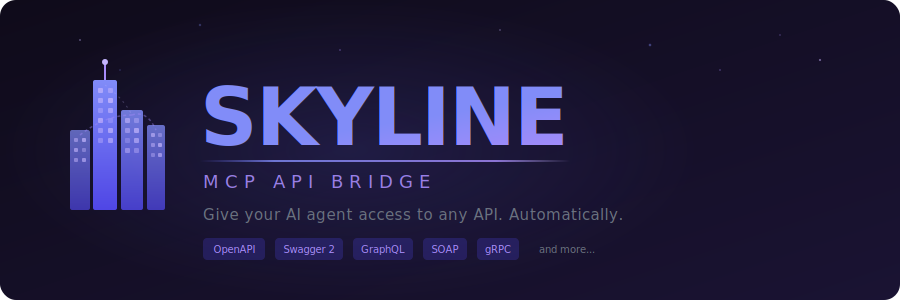

<p align="center">
  
</p>

<p align="center">
  <strong>Give your AI agent access to any API. Automatically.</strong>
</p>

<p align="center">
  Point Skyline at an API spec, add credentials, and every endpoint becomes an MCP tool your AI can call.<br/>
  No glue code. No per-API adapters. Just config.
</p>

<p align="center">
  <a href="https://skyline.projex.cc">
    
  </a>
  <a href="https://skyline.projex.cc/docs">
    
  </a>
  <a href="https://github.com/emadomedher/skyline-mcp/releases/latest">
    
  </a>
</p>

<br/>

---

## What is Skyline?

Skyline is an **MCP (Model Context Protocol) server** that turns external APIs into tools AI agents can use. It reads API specifications, normalizes them into a canonical model, and exposes every operation as a callable MCP tool with full JSON Schema validation.

You describe your APIs in a YAML file. Skyline does the rest:

```
  ┌──────────────┐      ┌────────────────┐      ┌──────────────────┐
  │  API Specs   │ ---> │    Skyline      │ ---> │    MCP Tools     │
  │              │      │                 │      │                  │
  │  OpenAPI     │      │  Auto-detect    │      │  tools/list      │
  │  Swagger 2   │      │  Parse & norm   │      │  tools/call      │
  │  GraphQL     │      │  Validate       │      │  resources/list  │
  │  SOAP/WSDL   │      │  Execute        │      │  resources/read  │
  │  OData v4    │      │                 │      │                  │
  │  gRPC        │      │  stdio / HTTP   │      │  Claude, Cursor  │
  │  JSON-RPC    │      │                 │      │  or any MCP host │
  │  Postman     │      │                 │      │                  │
  │  AsyncAPI    │      │                 │      │                  │
  │  RAML        │      │                 │      │                  │
  │  API Bluepr. │      │                 │      │                  │
  │  Insomnia    │      │                 │      │                  │
  │  Jenkins     │      │                 │      │                  │
  │  Jira Cloud  │      │                 │      │                  │
  │  Google API  │      │                 │      │                  │
  │  CKAN        │      │                 │      │                  │
  └──────────────┘      └────────────────┘      └──────────────────┘
```

---

## 🚀 Code Execution (Default)

Skyline uses **code execution** by default, providing up to **98% cost reduction** compared to traditional MCP:

**Traditional MCP:**
- AI evaluates 100+ tool definitions (~20K tokens)
- Makes 5-7 separate tool calls
- Sends intermediate data back and forth (~5K tokens per call)
- **Cost: ~$0.081 per request** (Claude Opus)

**Code Execution (Default):**
- AI receives tool hints (~2K tokens)
- Writes one JavaScript script
- Skyline executes code in embedded Goja JS runtime — zero external dependencies
- Code calls tools internally, filters data locally
- **Cost: ~$0.002 per request** (97.7% cheaper!)

**Monthly savings:** $7,900 for 100K requests

### Requirements

Code execution uses the **embedded Goja JS runtime** (a pure-Go JavaScript engine). There are **no external dependencies** — everything is compiled into the Skyline binary.

```bash
curl -fsSL https://skyline.projex.cc/install | bash
```

### Disable Code Execution

```yaml
# config.yaml
enable_code_execution: false  # Use traditional MCP tools
```

See the [Skyline documentation](https://skyline.projex.cc/docs) for full details on code execution.

---

## Supported API Types

Skyline auto-detects the spec format. No manual configuration needed.

| Protocol | Detection | Notes |
|---|---|---|
| **OpenAPI 3.x** | `openapi` field in JSON/YAML | Full path, query, header, and body parameter support |
| **Swagger 2.0** | `swagger` field | Automatically converted to OpenAPI 3 internally |
| **GraphQL** | SDL files or introspection | Builds typed queries with variable support and selection sets |
| **WSDL 1.1 / SOAP** | XML with `<definitions>` | Generates SOAP envelopes, parses XML responses to JSON |
| **OData v4** | CSDL `$metadata` XML | Generates CRUD operations per EntitySet with OData query options |
| **gRPC** | `spec_type: grpc` in config | Discovers services via gRPC reflection; builds dynamic protobuf messages |
| **OpenRPC / JSON-RPC** | `openrpc` field in JSON | Wraps calls in JSON-RPC 2.0 envelopes; supports `rpc.discover` |
| **Postman Collections** | `schema.getpostman.com` in JSON | Walks v2.x collection items; supports folders, path/query/header params, body modes |
| **Google API Discovery** | `discoveryVersion` field | Maps Google's discovery format to REST operations |
| **Jenkins 2.545** ⚠️ | `/api/json` object graph | **34 operations** - Custom implementation. Jobs, builds, pipelines, Blue Ocean, nodes, credentials, plugins, queue. Full CSRF support. See [special cases](#special-cases) |
| **Slack Web API** ⚠️ | `{"ok":...}` response format | **23 operations** - Custom implementation. Chat, conversations, users, files, reactions, pins, reminders. See [special cases](#special-cases) |
| **Jira Cloud** | `*.atlassian.net` host | Auto-fetches the official Atlassian OpenAPI spec |
| **AsyncAPI** | `asyncapi` field in JSON/YAML | Event-driven APIs; maps channels and operations to MCP tools |
| **RAML** | `#%RAML` header | RESTful API Modeling Language; full resource/method support |
| **API Blueprint** | `FORMAT: 1A` header | Markdown-based API description; parses resource groups and actions |
| **Insomnia** | `_type: export` in JSON | Insomnia export collections; walks request items with full param support |
| **CKAN Open Data** ⚠️ | `/api/3/action/` endpoint or `spec_type: ckan` | **7 operations** — Custom implementation. Dataset search, resource access, datastore queries, organization/tag listing. Compatible with any CKAN 2.x/3.x portal worldwide. |

---

## 🎯 Recommended: Web UI Configuration

**The Web UI is the easiest and most secure way to configure Skyline.** All configurations are encrypted automatically with AES-256-GCM.

### Start the Web UI

```bash
# Default mode: HTTP + Admin UI
skyline

# Or with explicit flags
skyline --transport http --admin --bind localhost:8191

# Open browser
# https://localhost:8191/ui/
# https://localhost:8191/admin/
```

The encryption key is **automatically generated** on first run and saved to `~/.skyline/skyline.env`.

### Features

- ✅ **Point-and-click configuration** - No YAML editing required
- ✅ **Automatic encryption** - All profiles encrypted at rest with AES-256-GCM
- ✅ **API testing** - Test endpoints before saving
- ✅ **Syntax validation** - Catch errors before they break
- ✅ **Secure credential storage** - Never store plaintext secrets
- ✅ **Multiple profiles** - Separate configs for dev/staging/prod

### Understanding Encryption Key vs Profile Tokens

**🔑 Encryption Key (`SKYLINE_PROFILES_KEY`):**
- Encrypts the ENTIRE `profiles.enc.yaml` file containing ALL your profiles
- Share with your team via secure channels (1Password, Vault, etc.)
- Protects data at rest on disk

**🎫 Profile Tokens (per profile):**
- Control WHO can access WHICH specific profile
- Give each user only the tokens for profiles they need
- Provide access control and authentication

**Team Example:**
```yaml
# Everyone shares the encryption key to decrypt the file
export SKYLINE_PROFILES_KEY=abc123...

# But each person gets different profile tokens:
# - Developer: dev-token-abc (can only access dev-api)
# - DevOps: prod-token-xyz (can only access prod-api)
```

### Security

Profiles are encrypted using:
- **Algorithm:** AES-256-GCM (Galois/Counter Mode)
- **Key size:** 256 bits (32 bytes)
- **Authentication:** Built-in MAC prevents tampering
- **Storage:** `profiles.enc.yaml` (encrypted JSON envelope)

**See the [Skyline documentation](https://skyline.projex.cc/docs) for complete configuration documentation.**

---

## 🔧 Alternative: Manual Configuration

For users who prefer command-line tools:

### 1. Create a config

Config files support both **YAML** and **JSON** formats (auto-detected):

**YAML** (recommended for readability):
```yaml
# config.yaml
apis:
  - name: petstore
    spec_url: https://petstore3.swagger.io/api/v3/openapi.json
    auth:
      type: api-key
      header: X-API-Key
      value: ${PETSTORE_API_KEY}
```

**JSON** (for programmatic generation):
```json
{
  "apis": [
    {
      "name": "petstore",
      "spec_url": "https://petstore3.swagger.io/api/v3/openapi.json",
      "auth": {
        "type": "api-key",
        "header": "X-API-Key",
        "value": "${PETSTORE_API_KEY}"
      }
    }
  ]
}
```

Secrets use `${ENV_VAR}` syntax and are automatically redacted from all logs.

### 2. Run

```bash
# stdio (for Claude Desktop, Cursor, etc.)
go run ./cmd/skyline --config ./config.yaml

# streamable HTTP (for networked MCP clients)
go run ./cmd/skyline --config ./config.yaml --transport http --bind localhost:8191
```

### 3. Connect your AI

Add Skyline to your MCP client config. For Claude Desktop:

```json
{
  "mcpServers": {
    "skyline": {
      "command": "./bin/skyline",
      "args": ["--config", "./config.yaml"]
    }
  }
}
```

That's it. Your AI agent now has typed, validated tools for every API endpoint.

---

## Architecture

Skyline is built around three components:

### Skyline MCP Server &nbsp;`cmd/skyline`

The core. Loads your config, fetches and parses API specs, builds MCP tools, and serves them over stdio or HTTP.

```
Config (YAML)
  → Spec Fetcher (URL or file)
    → Auto-Detect adapter (OpenAPI | Swagger2 | GraphQL | WSDL | OData | OpenRPC | Postman | gRPC | AsyncAPI | RAML | API Blueprint | Insomnia | Jenkins | Google | Jira)
      → Canonical Model (Service → Operations → Parameters + Schemas)
        → MCP Registry (tools + resources + JSON Schema validators)
          → MCP Server (JSON-RPC 2.0 over stdio or streamable HTTP)
            → Runtime Executor (HTTP requests, gRPC calls, JSON-RPC envelopes, auth, retries)
```

### Admin UI & Profile Management

Built-in web interface for managing configurations, profiles, and server settings. Accessible via `--admin` flag (enabled by default).

```bash
# Start with admin UI (default)
skyline

# Or explicitly
skyline --transport http --admin --bind localhost:8191

# Open https://localhost:8191/ui/
# Open https://localhost:8191/admin/
```

Features:
- **Profile management** — Create named profiles (dev, staging, prod) with encrypted storage
- **AES-GCM encryption** — All profiles encrypted at rest, key auto-generated
- **Spec detection** — Auto-discover API specs from base URLs
- **Settings editor** — Edit server config.yaml via Web UI
- **Metrics & audit** — View API call history and performance stats

---

## Configuration Reference

### Full config example

```yaml
apis:
  - name: petstore-openapi
    spec_url: http://localhost:9999/openapi/openapi.json
    base_url_override: http://localhost:9999/openapi
    auth:
      type: bearer
      token: ${PETSTORE_TOKEN}

  - name: plants-soap
    spec_url: http://localhost:9999/wdsl/wsdl
    auth:
      type: bearer
      token: ${PLANTS_TOKEN}

  - name: cars-graphql
    spec_url: http://localhost:9999/graphql/schema
    base_url_override: http://localhost:9999/graphql
    auth:
      type: basic
      username: ${GRAPHQL_USER}
      password: ${GRAPHQL_PASS}

  - name: jira-cloud
    spec_url: https://your-domain.atlassian.net
    base_url_override: https://your-domain.atlassian.net
    auth:
      type: basic
      username: ${JIRA_EMAIL}
      password: ${JIRA_API_TOKEN}

  - name: movies-odata
    spec_url: http://localhost:9999/odata/$metadata
    base_url_override: http://localhost:9999/odata
    auth:
      type: bearer
      token: ${ODATA_TOKEN}

  - name: calculator-jsonrpc
    spec_url: http://localhost:9999/jsonrpc/openrpc.json
    base_url_override: http://localhost:9999/jsonrpc
    auth:
      type: api-key
      header: X-API-Key
      value: ${JSONRPC_KEY}

  - name: clothes-grpc
    spec_type: grpc
    base_url_override: localhost:50051
    auth:
      type: bearer
      token: ${GRPC_TOKEN}

  - name: jenkins
    spec_url: https://jenkins.example.com/api/json
    base_url_override: https://jenkins.example.com
    auth:
      type: basic
      username: ${JENKINS_USER}
      password: ${JENKINS_API_TOKEN}  # Generate at /me/configure

timeout_seconds: 10
retries: 1
```

### Auth types

| Type | Fields |
|---|---|
| `bearer` | `token` |
| `basic` | `username`, `password` |
| `api-key` | `header`, `value` |

### API config fields

| Field | Required | Description |
|---|---|---|
| `name` | yes | Unique name for this API (used as tool name prefix) |
| `spec_url` | yes* | URL or file path to the API spec |
| `spec_type` | no | Force spec type instead of auto-detect. Currently only `grpc` is supported |
| `base_url_override` | no* | Override the base URL from the spec. Required for gRPC (`host:port`) |
| `auth` | no | Authentication config (see auth types below) |
| `jenkins` | no | Jenkins-specific config for write operations |

\* `spec_url` is not required when `spec_type: grpc` is set (uses live reflection instead).

### MCP server flags

| Flag | Default | Description |
|---|---|---|
| `--config` | `./config.yaml` | Path to config file (YAML or JSON, auto-detected) |
| `--transport` | `http` | `stdio` or `http` |
| `--bind` | `localhost:8191` | Listen address for HTTP transport |
| `--admin` | `true` | Enable Web UI and admin dashboard (HTTP only) |

### Additional flags

| Flag | Default | Description |
|---|---|---|
| `--storage` | `./profiles.enc.yaml` | Encrypted storage path |
| `--auth-mode` | `bearer` | `bearer` or `none` |
| `--key-env` | `SKYLINE_PROFILES_KEY` | Env var holding the 32-byte AES key |
| `--env-file` | | Optional `.env` file to load |

---

## Transport Modes

Skyline supports multiple transport modes:

```bash
# HTTP + Admin UI (default)
skyline
# or explicitly:
skyline --transport http --admin

# HTTP only (no UI)
skyline --transport http --admin=false

# STDIO for Claude Desktop (coming soon)
skyline --transport stdio
```

---

## Project Layout

```
skyline-mcp/
│
├── cmd/                              # ── Entrypoint ─────────────────
│   └── skyline/                      #    Unified binary
│       ├── server.go                 #      All transports (http, stdio)
│       └── ui/                       #      Embedded Web UI & admin
│           ├── index.html
│           ├── admin.html
│           ├── app.js
│           └── styles.css
│
├── internal/                         # ── Core ───────────────────────
│   ├── canonical/                    #    Unified API model
│   │   ├── types.go                  #      Service, Operation, Parameter
│   │   └── naming.go                 #      Tool name generation
│   ├── config/                       #    Configuration
│   │   ├── config.go                 #      Types, validation, defaults
│   │   ├── load.go                   #      YAML file loading
│   │   ├── parse.go                  #      YAML parsing
│   │   ├── env.go                    #      ${ENV_VAR} expansion
│   │   └── remote.go                 #      Config server profile fetching
│   ├── mcp/                          #    MCP Protocol
│   │   ├── server.go                 #      JSON-RPC 2.0 handler (stdio)
│   │   ├── http_sse.go               #      Streamable HTTP + SSE transport
│   │   └── registry.go               #      Tool & resource registry
│   ├── runtime/                      #    Execution
│   │   └── executor.go               #      HTTP client, auth, retries
│   ├── redact/                       #    Security
│   │   └── redact.go                 #      Secret redaction for logs
│   │
│   ├── spec/                         # ── Spec Pipeline ──────────────
│   │   ├── adapter.go                #      SpecAdapter interface
│   │   ├── loader.go                 #      Auto-detect + parse orchestrator
│   │   ├── fetch.go                  #      Spec URL fetcher
│   │   ├── openapi_adapter.go        #      OpenAPI 3.x adapter
│   │   ├── swagger2_adapter.go       #      Swagger 2.0 adapter
│   │   ├── graphql_adapter.go        #      GraphQL adapter
│   │   ├── graphql_introspection.go  #      GraphQL introspection query
│   │   ├── wsdl_adapter.go           #      WSDL / SOAP adapter
│   │   ├── odata_adapter.go          #      OData v4 adapter
│   │   ├── openrpc_adapter.go        #      OpenRPC / JSON-RPC adapter
│   │   ├── postman_adapter.go        #      Postman Collections adapter
│   │   ├── grpc_adapter.go           #      gRPC adapter
│   │   ├── google_adapter.go         #      Google API Discovery adapter
│   │   ├── jenkins_adapter.go        #      Jenkins adapter
│   │   ├── jenkins_writes.go         #      Jenkins write operations
│   │   ├── asyncapi_adapter.go       #      AsyncAPI adapter
│   │   ├── raml_adapter.go           #      RAML adapter
│   │   ├── apiblueprint_adapter.go   #      API Blueprint adapter
│   │   └── insomnia_adapter.go       #      Insomnia adapter
│   │
│   └── parsers/                      # ── Parsers ────────────────────
│       ├── openapi/                  #      OpenAPI 3.x parser
│       ├── swagger2/                 #      Swagger 2.0 parser
│       ├── graphql/                  #      GraphQL SDL + introspection
│       ├── wsdl/                     #      WSDL 1.1 parser
│       ├── odata/                    #      OData v4 CSDL parser
│       ├── openrpc/                  #      OpenRPC / JSON-RPC parser
│       ├── postman/                  #      Postman Collection v2.x parser
│       ├── grpc/                     #      gRPC reflection parser
│       ├── googleapi/                #      Google API Discovery parser
│       ├── jenkins/                  #      Jenkins object graph parser
│       ├── asyncapi/                 #      AsyncAPI parser
│       ├── raml/                     #      RAML parser
│       ├── apiblueprint/             #      API Blueprint parser
│       └── insomnia/                 #      Insomnia collection parser
│
├── examples/                         # ── Examples ───────────────────
│   ├── config.yaml.example           #    Full config with all API types
│   ├── config.mock.yaml              #    Config for mock-api server
│   ├── config.yaml                   #    Minimal working config
│   └── skyline.env.example           #    Server env template
│
├── assets/                           # ── Branding ───────────────────
│   ├── skyline-banner.svg
│   └── skyline-logo.svg
│
├── Dockerfile                        # ── Docker ──────────────────────
├── go.mod
├── go.sum
└── README.md
```

---

## Jenkins 2.545 Integration

Skyline provides comprehensive support for Jenkins 2.x with **34 operations** covering all major Jenkins APIs. Perfect for CI/CD automation, build management, and pipeline orchestration.

### Quick Start

```yaml
apis:
  - name: jenkins
    spec_url: https://jenkins.example.com/api/json
    base_url_override: https://jenkins.example.com
    auth:
      type: basic
      username: admin
      password: ${JENKINS_API_TOKEN}
```

### Features

- ✅ **Auto-detects Jenkins 2.x** - No manual configuration
- ✅ **34 operations** across 10 API categories
- ✅ **Automatic CSRF handling** - Crumb fetching and caching
- ✅ **Parameterized builds** - Full parameter support
- ✅ **Pipeline support** - Jenkinsfile creation, replay, stages
- ✅ **Blue Ocean API** - Modern Pipeline visualization

### Operations Coverage

| Category | Operations | Examples |
|----------|------------|----------|
| **Core** (3) | Root, object queries, version | `jenkins__getVersion`, `jenkins__getRoot` |
| **Job Management** (9) | CRUD, enable/disable, copy | `jenkins__createJob`, `jenkins__listJobs` |
| **Build Operations** (7) | Trigger, stop, logs, artifacts | `jenkins__triggerBuild`, `jenkins__getBuildLog` |
| **Pipeline** (3) | Create, replay, stages | `jenkins__createPipeline`, `jenkins__getPipelineStages` |
| **Queue** (2) | View, cancel | `jenkins__getQueue`, `jenkins__cancelQueueItem` |
| **Nodes** (4) | List, configure, offline, delete | `jenkins__listNodes`, `jenkins__markNodeOffline` |
| **Credentials** (1) | List stores | `jenkins__listCredentials` |
| **Plugins** (1) | List installed | `jenkins__listPlugins` |
| **Blue Ocean** (2) | Pipelines, runs | `jenkins__blueOceanPipelines` |
| **Users** (2) | User info | `jenkins__getCurrentUser`, `jenkins__getUser` |

### Example Usage

**List all jobs:**
```json
{
  "tool": "jenkins__listJobs",
  "arguments": {}
}
```

**Trigger a parameterized build:**
```json
{
  "tool": "jenkins__triggerBuildWithParameters",
  "arguments": {
    "jobName": "deploy-prod",
    "parameters": {
      "BRANCH": "main",
      "ENVIRONMENT": "production"
    }
  }
}
```

**Get build console log:**
```json
{
  "tool": "jenkins__getBuildLog",
  "arguments": {
    "jobName": "my-job",
    "buildNumber": "lastBuild"
  }
}
```

### Deployment Example

**Kubernetes (Tested with Jenkins 2.545):**
```yaml
apiVersion: apps/v1
kind: Deployment
metadata:
  name: jenkins
spec:
  template:
    spec:
      containers:
      - name: jenkins
        image: jenkins/jenkins:2.545-jdk21
        ports:
        - containerPort: 8080
```

See the [Skyline documentation](https://skyline.projex.cc/docs) for complete Jenkins integration docs including all 34 operations with examples, authentication guide, CSRF handling, and troubleshooting.

---

## Special Cases

Some APIs don't provide machine-readable specifications (OpenAPI, GraphQL schema, etc.) or have specification issues that prevent auto-detection. For these, Skyline includes **custom adapters** that manually define operations based on official API documentation.

### Jenkins 2.545 ⚠️

**Why custom?**  
Jenkins doesn't expose an API specification. The `/api/json` endpoint returns current **state** (jobs, builds, queues), not endpoint definitions. There's no machine-readable documentation of available operations, parameters, or schemas.

**Solution:**  
Manually implemented 34 operations based on [Jenkins REST API documentation](https://www.jenkins.io/doc/book/using/remote-access-api/), including:
- Automatic CSRF crumb handling
- Parameterized build support
- Pipeline operations (Jenkinsfile, replay, stages)
- Blue Ocean API integration
- Node/agent management

**See:** [Skyline documentation](https://skyline.projex.cc/docs) for full Jenkins integration details.

### Slack Web API ⚠️

**Why custom?**  
Slack provides an OpenAPI spec (Swagger 2.0) at `https://api.slack.com/specs/openapi/v2/slack_web.json`, but it contains **validation errors** that break standard Swagger → OpenAPI 3 conversion:

- Uses non-standard array-based `items` for union types (oneOf)
- Example: `"items": [{"$ref": "..."}, {"type": "null"}]` (should be object)
- 3 definitions affected: `objs_conversation`, `objs_response_metadata`, `objs_user`

**Solution:**  
Manually implemented 23 most-used operations based on [Slack Web API documentation](https://api.slack.com/web), including:

**Operations (23):**
- **Chat (4):** postMessage, update, delete, getPermalink
- **Conversations (6):** list, create, history, invite, info, archive
- **Users (3):** list, info, conversations
- **Files (2):** upload, list
- **Reactions (2):** add, remove
- **Pins (3):** add, remove, list
- **Reminders (2):** add, list
- **Channels (1):** list (legacy)

**Auth:**  
Bearer token (bot token or user token with appropriate scopes).

**Example:**
```yaml
apis:
  - name: slack
    spec_url: https://slack.com/api/auth.test  # Any Slack endpoint (for detection)
    base_url_override: https://slack.com/api
    auth:
      type: bearer
      token: ${SLACK_BOT_TOKEN}
```

**Future:** If Slack fixes their OpenAPI spec validation issues, Skyline can switch to auto-detection for full 172-operation coverage.

### CKAN Open Data Portals ⚠️

**Why custom?**
CKAN (https://ckan.org) is the open-source data management system powering the majority of government open data portals worldwide. It does not expose an OpenAPI, Swagger, or any machine-readable specification — it uses its own fixed action-based JSON API at `/api/3/action/{action}`.

**Solution:**
Manually implemented 7 core operations based on the [CKAN API documentation](https://docs.ckan.org/en/latest/api/), covering dataset discovery, resource access, and datastore queries.

**Operations (7):**
- **searchDatasets** — Full-text search with filter queries, sorting, and pagination
- **listDatasets** — List all published dataset names with pagination
- **getDataset** — Full dataset metadata including all resources
- **getResource** — Individual resource (file/link) metadata and download URL
- **queryDatastore** — Filtered SQL-style queries against tabular data resources
- **listOrganizations** — All data publishers/organizations on the portal
- **listTags** — All subject tags used to categorize datasets

**Compatible portals (any CKAN 2.x / 3.x instance):**
- 🇺🇸 **data.gov** — US Federal Open Data
- 🇬🇧 **data.gov.uk** — UK Government Data
- 🇸🇦 **open.data.gov.sa** — Saudi Arabia Open Data
- 🇪🇺 **data.europa.eu** — EU Open Data Portal
- 🇦🇺 **data.gov.au** — Australian Government Data
- 🇨🇦 **open.canada.ca** — Canada Open Data
- 🇮🇳 **data.gov.in** — India Government Data
- 🇧🇷 **dados.gov.br** — Brazil Open Data
- And **100+ more** national, regional, and city portals

**Example:**
```yaml
apis:
  - name: us-open-data
    spec_type: ckan
    base_url_override: https://catalog.data.gov
    # No auth needed for public portals
    # auth required only for private datasets:
    # auth:
    #   type: api-key
    #   header: Authorization
    #   value: ${CKAN_API_TOKEN}
```

**Auto-detection:** Skyline can also auto-detect CKAN portals — just provide the base URL and Skyline will probe `/api/3/action/package_list` to confirm it's a CKAN instance.

---

## Building

```bash
# Build the binary
go build -o ./bin/skyline ./cmd/skyline

# Run tests
go test ./...

# Build from source (install script does this)
curl -fsSL https://skyline.projex.cc/install | bash -s source
```

### Docker

```bash
# Build the container
docker build -t skyline-mcp .

# Run with a config file
docker run -p 8191:8191 -v $(pwd)/config.yaml:/app/config.yaml skyline-mcp
```

---

## Troubleshooting

| Problem | Fix |
|---|---|
| Startup fails with "missing env" | Ensure all `${ENV_VAR}` references in your config have corresponding environment variables set |
| Spec load fails | Verify the `spec_url` is reachable; use the config server's test feature to check |
| Tool call returns auth errors | Double-check your `auth` block; bearer tokens, API keys, and basic auth credentials must match what the target API expects |
| SOAP responses look like raw XML | This is expected for non-standard SOAP services; Skyline parses standard SOAP envelopes automatically |

---

## Examples & Testing

### Mocking Bird - Test API Server

**Repository:** [github.com/emadomedher/mocking-bird](https://github.com/emadomedher/mocking-bird)

Mocking Bird is a standalone mock API server that implements **all 7 protocol types** supported by Skyline. It's the perfect testing companion for validating Skyline's functionality without needing real API credentials or external dependencies.

#### Why Mocking Bird?

**1. Protocol Coverage Testing**  
Test every spec adapter (OpenAPI, GraphQL, WSDL, OData, etc.) locally without external services:

```yaml
apis:
  - name: pets-openapi
    spec_url: http://localhost:9999/openapi/openapi.json
  - name: cars-graphql
    spec_url: http://localhost:9999/graphql/schema
  - name: plants-soap
    spec_url: http://localhost:9999/wdsl/wsdl
  - name: movies-odata
    spec_url: http://localhost:9999/odata/$metadata
  - name: calculator-jsonrpc
    spec_url: http://localhost:9999/jsonrpc/openrpc.json
```

**2. Integration Testing**  
Validate Skyline's MCP tool generation, JSON Schema validation, and runtime execution without hitting production APIs.

**3. Development Workflow**  
Develop and test new Skyline features (auth handling, error recovery, spec parsing) against a predictable, controllable API environment.

**4. CI/CD Pipeline Integration**  
Run automated tests in CI without API keys, rate limits, or network flakiness.

#### Mocking Bird API Coverage

| Mock API | Protocol | Port | Spec Endpoint |
|---|---|---|---|
| **Pets** | OpenAPI 3.x | 9999 | `/openapi/openapi.json` |
| **Dinosaurs** | Swagger 2.0 | 9999 | `/swagger/swagger.json` |
| **Plants** | WSDL/SOAP | 9999 | `/wdsl/wsdl` |
| **Cars** | GraphQL | 9999 | `/graphql/schema` |
| **Movies** | OData v4 | 9999 | `/odata/$metadata` |
| **Calculator** | JSON-RPC 2.0 | 9999 | `/jsonrpc/openrpc.json` |
| **Clothes** | gRPC | 50051-54 | Server reflection enabled |

#### Quick Start with Mocking Bird

```bash
# Clone and run Mocking Bird
git clone https://github.com/emadomedher/mocking-bird
cd mocking-bird
go run .
# Listening on http://localhost:9999

# In another terminal, run Skyline with mock config
cd skyline-mcp
go run ./cmd/skyline --config ./examples/config.mock.yaml
```

#### Example Config for Mocking Bird

See **[examples/config.mock.yaml](examples/config.mock.yaml)** for a complete working config that uses all Mocking Bird endpoints:

```yaml
apis:
  - name: pets-openapi
    spec_url: http://localhost:9999/openapi/openapi.json
    base_url_override: http://localhost:9999/openapi

  - name: dinosaurs-swagger
    spec_url: http://localhost:9999/swagger/swagger.json
    base_url_override: http://localhost:9999/swagger
    auth:
      type: bearer
      token: MOCK_DINO_TOKEN

  - name: plants-soap
    spec_url: http://localhost:9999/wdsl/wsdl
    auth:
      type: bearer
      token: MOCK_TOKEN

  - name: cars-graphql
    spec_url: http://localhost:9999/graphql/schema
    base_url_override: http://localhost:9999/graphql
    auth:
      type: basic
      username: graphql-user
      password: MOCK_GRAPHQL_PASS

  - name: movies-odata
    spec_url: http://localhost:9999/odata/$metadata
    base_url_override: http://localhost:9999/odata

  - name: calculator-jsonrpc
    spec_url: http://localhost:9999/jsonrpc/openrpc.json
    base_url_override: http://localhost:9999/jsonrpc
    auth:
      type: api-key
      header: X-API-Key
      value: calc-key
```

#### Test All Tools

Once running, use the MCP inspector or any MCP client to verify:

```bash
# List all generated tools
mcpx tools list

# Test OpenAPI (Pets)
mcpx tools call pets-openapi__listPets

# Test GraphQL (Cars)
mcpx tools call cars-graphql__query_listCars

# Test SOAP (Plants)
mcpx tools call plants-soap__getAllPlants

# Test OData (Movies)
mcpx tools call movies-odata__listMovies

# Test JSON-RPC (Calculator)
mcpx tools call calculator-jsonrpc__add '{"a": 5, "b": 3}'
```

**Result:** Full end-to-end validation of Skyline's spec parsing, tool generation, and runtime execution across all supported protocols.

---

## Uninstall

To completely remove Skyline from your system:

```bash
curl -fsSL https://skyline.projex.cc/uninstall | bash
```

This will:
- Stop and disable systemd service
- Remove service file
- Remove binary from `/usr/local/bin` or `~/.local/bin`
- Preserve your data in `~/.skyline/` (profiles, config, audit DB)

**Manual removal:**

```bash
# Stop service
systemctl --user stop skyline
systemctl --user disable skyline

# Remove service file
rm -f ~/.config/systemd/user/skyline.service
systemctl --user daemon-reload

# Remove binary
sudo rm -f /usr/local/bin/skyline
rm -f ~/.local/bin/skyline

# Optional: remove data
rm -rf ~/.skyline/
```

---

<p align="center">
  
</p>

<p align="center">
  <sub>Built with Go. Powered by MCP.</sub>
</p>

---

## License

**GNU Affero General Public License v3.0 (AGPL-3.0)**

Skyline is licensed under the AGPL-3.0. See [LICENSE](LICENSE) for the full license text.

### Why AGPL-3.0?

- ✅ **Strong copyleft**: Ensures the software and all modifications remain open source
- ✅ **Network protection**: Users interacting over a network get access to the source code
- ✅ **Commercial use**: Can be used commercially, but modifications must be shared
- ✅ **Community first**: Contributions benefit everyone in the ecosystem

**Copyright 2026 [Projex Digital](https://projex.cc)**

